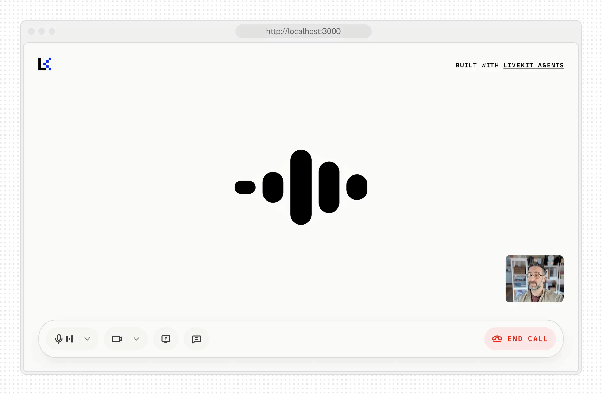

Alexis: [GreatAI Hackathon](https://greataihackathon.com/).

# GreatAI Frontend

[](https://livekit.io/)
[](https://nextjs.org/)
[](https://www.typescriptlang.org/)

This repository contains the frontend implementation for the GreatAI Hackathon. It is built using Next.js and LiveKit to provide a real-time voice agent interface with Google authentication.

## Features

- **Google Authentication** - Secure user authentication using NextAuth.js
- **Voice Interaction** - Real-time voice communication with LiveKit Agents
- **Video Support** - Camera streaming and screen sharing capabilities
- **Responsive UI** - Modern, responsive interface with light/dark theme support
- **Virtual Avatars** - Integration with virtual avatars for enhanced user experience

<picture>
  <source srcset="./.github/assets/readme-hero-dark.webp" media="(prefers-color-scheme: dark)">
  <source srcset="./.github/assets/readme-hero-light.webp" media="(prefers-color-scheme: light)">
  
</picture>

## Project Structure

```
greataihackathon-frontend/
├── app/                    # Next.js app directory
│   ├── (app)/             # Main application routes
│   ├── api/               # API routes
│   │   ├── auth/          # Authentication API routes
│   │   ├── calendar/      # Calendar integration
│   │   └── connection-details/  # LiveKit connection details
│   ├── components/        # Shared components
│   └── fonts/             # Custom fonts
├── components/            # Global components
│   ├── livekit/           # LiveKit UI components
│   └── ui/                # Reusable UI components
├── hooks/                 # Custom React hooks
├── lib/                   # Utility functions and configs
│   ├── auth.ts            # Authentication configuration
│   └── session.ts         # Session management
├── public/                # Static assets
├── .env.local             # Environment variables (ignored in .gitignore)
├── next.config.ts         # Next.js configuration
├── package.json           # Project dependencies
└── tsconfig.json          # TypeScript configuration
```

## Getting Started

### Prerequisites

- Node.js 18+ and [pnpm](https://pnpm.io/)
- Google OAuth credentials (Client ID and Secret)
- LiveKit API credentials

### Environment Setup

1. Copy the example environment file:
   ```bash
   cp .env.example .env.local
   ```

2. Update the environment variables in `.env.local`:
   ```env
   # Google OAuth
   GOOGLE_CLIENT_ID=your_google_client_id
   GOOGLE_CLIENT_SECRET=your_google_client_secret
   
   # NextAuth
   NEXTAUTH_SECRET=your_nextauth_secret
   NEXTAUTH_URL=http://localhost:3000
   
   # LiveKit
   NEXT_PUBLIC_LIVEKIT_URL=your_livekit_url
   LIVEKIT_API_KEY=your_livekit_api_key
   LIVEKIT_API_SECRET=your_livekit_secret
   ```

### Installation

1. Install dependencies:
   ```bash
   pnpm install
   ```

2. Start the development server:
   ```bash
   pnpm dev
   ```

3. Open [http://localhost:3000](http://localhost:3000) in your browser

## Google Authentication Setup

1. Go to the [Google Cloud Console](https://console.cloud.google.com/)
2. Create a new project or select an existing one
3. Navigate to "APIs & Services" > "Credentials"
4. Click "Create Credentials" > "OAuth client ID"
5. Select "Web application" as the application type
6. Add authorized JavaScript origins: `http://localhost:3000`
7. Add authorized redirect URIs: `http://localhost:3000/api/auth/callback/google`
8. Copy the Client ID and Client Secret to your `.env.local` file

Run the following command to automatically clone this template.

```bash
lk app create --template agent-starter-react
```

Then run the app with:

```bash
pnpm install
pnpm dev
```

And open http://localhost:3000 in your browser.

You'll also need an agent to speak with. Try our starter agent for [Python](https://github.com/livekit-examples/agent-starter-python), [Node.js](https://github.com/livekit-examples/agent-starter-node), or [create your own from scratch](https://docs.livekit.io/agents/start/voice-ai/).

## Configuration

Customize the application by modifying `app-config.ts`:

```typescript
export const APP_CONFIG_DEFAULTS = {
  companyName: 'GreatAI',
  pageTitle: 'Voice Agent',
  pageDescription: 'An interactive voice agent with Google authentication',
  
  // Feature Flags
  supportsChatInput: true,
  supportsVideoInput: true,
  supportsScreenShare: true,
  isPreConnectBufferEnabled: true,

  // Branding
  logo: '/logo.svg',
  accent: '#002cf2',
  logoDark: '/logo-dark.svg',
  accentDark: '#1fd5f9',
  startButtonText: 'Start Call',
  agentName: 'Assistant',
};
```

## Deployment

### Production Build

```bash
# Install dependencies
pnpm install

# Build the application
pnpm build

# Start the production server
pnpm start
```

### Environment Variables

Required environment variables for production:

```env
NEXTAUTH_SECRET=your_nextauth_secret
NEXTAUTH_URL=https://yourdomain.com
GOOGLE_CLIENT_ID=your_google_client_id
GOOGLE_CLIENT_SECRET=your_google_client_secret
NEXT_PUBLIC_LIVEKIT_URL=wss://your-livekit-instance.livekit.cloud
LIVEKIT_API_KEY=your_livekit_api_key
LIVEKIT_API_SECRET=your_livekit_secret
```

## Contributing

1. Fork the repository
2. Create a feature branch (`git checkout -b feature/amazing-feature`)
3. Commit your changes (`git commit -m 'Add some amazing feature'`)
4. Push to the branch (`git push origin feature/amazing-feature`)
5. Open a Pull Request

## License

This project is licensed under the MIT License - see the [LICENSE](LICENSE) file for details.

---

For more information, visit [GreatAI Hackathon](https://greataihackathon.com/).

```env
LIVEKIT_API_KEY=your_livekit_api_key
LIVEKIT_API_SECRET=your_livekit_api_secret
LIVEKIT_URL=https://your-livekit-server-url
```

These are required for the voice agent functionality to work with your LiveKit project.

## Contributing

This template is open source and we welcome contributions! Please open a PR or issue through GitHub, and don't forget to join us in the [LiveKit Community Slack](https://livekit.io/join-slack)!
